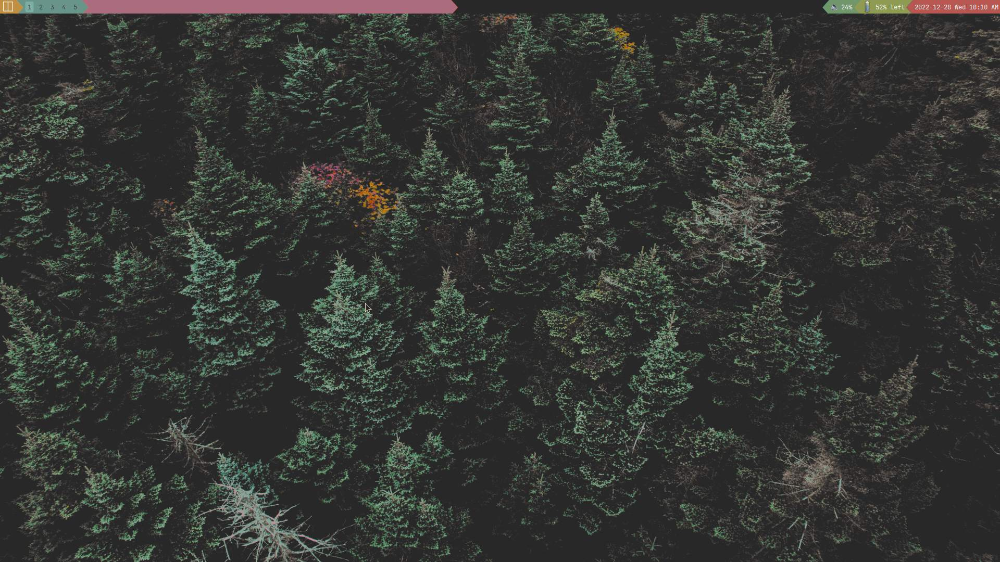

# qtile-gruvbox-material
A qtile configuration with a more superior theme

This is actually my personal configuration and uses my preferred applications (bound in the KEYS section)
I just thought, it might be helpful to someone.

**NOTE: I did not create the image and therefore am uninformed of the license. If you happen to be the rightful uploader, then please inform me.**
