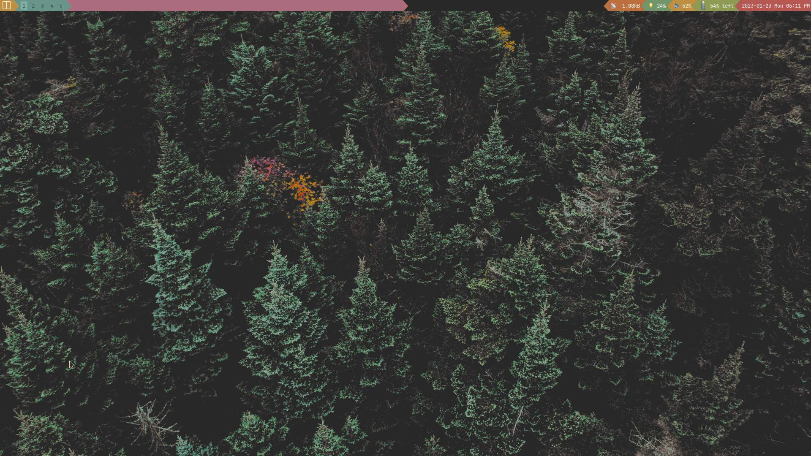

# qtile-gruvbox-material
A qtile configuration with a more superior theme

This was actually my personal configuration and uses my preferred applications (bound in the KEYS section)
I just thought, it might be helpful to someone.
Feel free to request reasonable changes.

